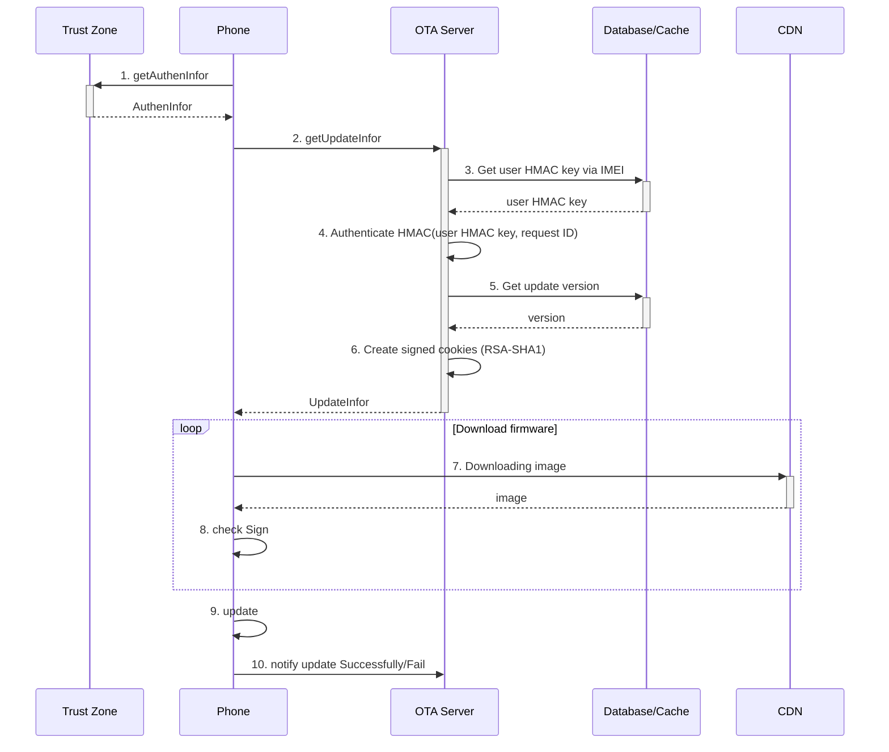
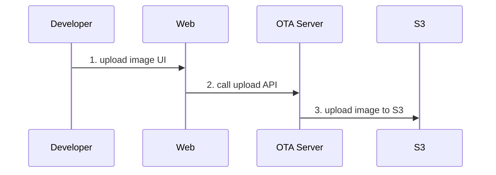
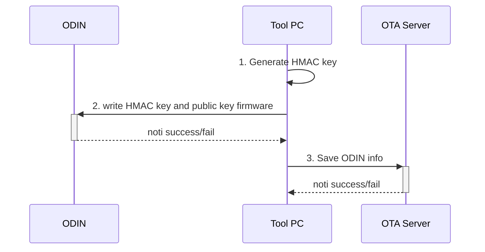

# Thiết kế hệ thống OTA cho ODIN 
## Yêu cầu thiết kế :
* Thiết kế server Update OTA cho ODIN
* Làm rõ API làm việc: xác thực, gửi nhận thông tin giữa ODIN và server.
* Thiết kế CSDL trên server.
* Thiết kế các khối chức năng và giao tiếp giữa các khối.

## ODIN lấy thông tin về bản cập nhật
Quy trình kiểm tra bản cập nhật mới nếu có:




### Các khốí chức năng trong quá trình cập nhật thông tin

|Tên Khối|Chức năng|
|:----|:-----|
|Trust Zone | Nơi lưu trữ các thông tin mật và private của điện thoại, ở đây Trust Zone lưu trữ password để xác thực với server của điện thoại.
|Phone|Điện thoại chủ động request lên server xem có bản update mới không hoặc yêu cầu update khi có notifi từ server. Sau khi update xong, điện thoại sẽ notify lên server về update thành công hay thất bại|
|OTA Server |Server tiếp nhận các request từ điện thoại yêu cầu kiểm tra các bản cập nhật, server sau khi xác thực device và request hợp lệ sẽ kiểm tra xem có bản cập nhật mới không, nếu có sẽ gửi đường dẫn đến bản OS update, nếu không sẽ trả về thông báo không có bản cập nhật mới|
|Database| Nơi lưu trữ và trả về các thông tin về điện thoại, bản cập nhật mới, thông tin xác thực. Khối này xây dựng sẵn các api dùng để lấy các thông tin mà OTA server yêu cầu.|
|Cache | Là nơi lưu trữ các signKey mà thiết bị gửi lên, đảm bảo signKey là hợp lệ và không trùng lặp. |
|CDN | Là một mạng phân phối nội dung, server sẽ lấy đường dẫn đến bản update mới trên CDN và trả về cho điện thoại.|

### 1. getAuthenInfor

Điện thoại sẽ lấy các thông tin xác thực từ flash. THông tin xác thực này bao gồm:

1. IMEI của điện thoại
2. Password để xác thực với server
   

### 2. getUpdateInfor

Điện thoại thực hiện gửi request đến OTA server với các thông tin:

1. IMEI
2. request ID (16 byte random)
3. signKey = HMAC_SHA256(key=Password, data=(IMEI + request ID))
4. Phiên bản hiện tại của điện thoại

Thông tin nhận vè từ OTA server sẽ là:

1. Có bản update mới hay không
2. Nếu có bản update mới thì sẽ có thêm thông tin:
   1. Tên bản firmware mới
   2. Cookies để sử dụng
   3. URL của phiên bản OS liền kề.
   4. Sign của các file
```
URL: /device/1.0/update/info?IMEI=<IMEI>&requestID=<requestID>&signKey=<signKey>&OSVersion=<OSVersion>&HWversion=<HWversion>
Method: GET
Respone body: (có bản update)
  {
    "update":"yes",
    "OS" : <link to os update file>
  }    

Respone body: (không có bản update)
    {
      "update":"no",
      "OS":<empty>
    }

Respone code:
  200: OK
  403: Authentication is failed
```
Sau khi nhận thông tin về OSversion của thiết bị hiện tại, server sẽ tra cứu danh sách các bản OS trong database và trả về đường dẫn đến bản liền sau của nó.

### 3. Get user HMAC key via IMEI

OTA Server sẽ sử dụng thông tin về IMEI nhận được từ client để xác nhận client để lấy được user HMAC key của client từ database.

### 4. Authenticate HMAC

OTA server tiến hành tính toán HMAC của request ID với key chính là user HMAC key vừa lấy từ database.

`hmac = HMAC_SHA256(key=user HMAC key, data=(IMEI + request ID))`

Sau đó server sẽ so sánh với mã signKey từ client gửi lên để xác nhận request đó được gửi từ ODIN.
Nếu mã HMAC không trùng nhau, server sẽ gửi lại thông báo lỗi và kết thúc phiên.

### 5. Get update version

Sau khi đã xác nhận request được gửi từ ODIN, server sẽ dựa vào tên phiên bản OS hiện tại để xác định xem có cần update hay không.

Nếu không cần update, OTA server sẽ trả vè thông báo không có version mới và kết thúc phiên. Nếu có bản update mới no sẽ thực hiện tiếp [bước 6](#6-create-signed-cookies)

### 6. Create signed cookies

OTA server sẽ sử dụng thuật toán RSA-SHA1 để tạo ra cookies cho client sử dụng download firmware sau này.

### 7. Downloading image

Sử dụng thông tin về cookies và danh sách url vừa nhận được từ OTA server, ODIN sẽ download các file firmware về máy.

### 8. check Sign

ODIN sẽ lấy thông tin public key từ bộ nhớ và tính RSA Sign của các file vừa tải về. Nếu RSA Sign bị sai so với thông tin nhận được ban đầu, ODIN sẽ tiến hành download lại file đó. Nếu đúng nó sẽ tiến hành ghi vào flash.

### 9. update

Sau khi download xong toàn bộ các file firmware, ODIN sẽ tiến hành khỏi động lại và load vào firmware mới.

### 10. notify update Successfully/Fail
Sau khi load vào firmware mới lần đầu, ODIN sẽ gửi thông tin về phiên bản hiện tại của OS lên server.
```
URL: /device/1.0/update/noti
Method: POST
Request Body:
    {
      "IMEI" : <IMEI>,
      "requestID" : <requestID>,
      "signKey" : <signKey>,
      "OSVersion" : <OSVersion>,
      "HWVersion" : <HWVersion>
    }

Respone code:
  200: OK
  403: Authentication is failed
  500: Fail
```
## Nhà sản xuất thêm firmware mới


### Các Khối chức năng trong quá trình developer thêm firmware mới

|Khối | Chức năng |
|:----|:----|
|Web | Là một giao diện web giúp developer dễ dàng upload các phiên bản os mới, web có thể tích hợp thên các chức năng xác thực và quản lý.|
|OTA server | Server có chức năng nhận và xử lý file upload từ web,server nhận thông tin upload user, requestID, sign key , tên sản phẩm. Sau khi xác thực hợp lệ, server sẽ upload bản update lên CDN. |
|S3|Là dịch vụ lưu trữ dữ liệu của Amazon, đây là nơi lưu trữ các bản OS mới|


### 1. upload image UI

Khi release bản firmware mới, nhân viên sẽ đăng nhập vào trang web để tải firmware mới lên

### 2. call upload API

Web client sẽ gọi vào API của OTA server để upload firmware lên.

```
URL: /dev/1.0/upload?user=<user>&requestID=<requestID>&signKey=<signKey>&production=<production>
Method: POST
Content Type: “form-data”
Body:
  file: file content
```

### 3. upload image to S3

Sau khi nhận được file từ web client, server sẽ kiểm tra tính hợp lệ và upload lên S3. Đường dẫn của 1 file sẽ có cấu trúc:

`<Tên dòng máy>/<Tên firmware>/<Tên version>/<sign>`

Trong đó giá trị `sign` được tính theo công thức:

```
sign = RSA_SHA256(key = firmware key, data = CRC32(firmware))
```

Các firmware sẽ được lưu trong các thưa mục tương tự như sau:

```
.
└── ODIN_v1
      └── OS
           ├── cn_1.0.0
           |   └── 12312312312312
           ├── cn_1.1.0
           |   └── 12312312312312
           |   
           ├── vn_1.0.0
           |   └── 12312312312312
           └── vn_1.1.0
               └── 12312312312312
   
```

## Thay đổi khi nạp firmware khi sản xuất


### Các khối chức năng khi nạp Firmware lần đầu cho điện thoại

|Khối | Chức năng |
|:----|:-----|
|Tool PC | Là một phần mềm trên máy tính có chức năng khởi tạo HMAC key cho điện thoại ODIN, sau khi khởi tạo HMAC key và public key, nó sẽ gửi về cho điện thoại. Điện thoại sẽ thông báo việc khởi tạo thành công hay thất bại cho Tool PC|
|OTA server |Server sẽ nhận thông tin về điện thoại từ Tool PC sau đó lưu vào cơ sở dữ liệu, các thông tin này gồm signkey, IMEI, production name và OS version sau khi nạp lần đầu.|
### 1. Generate HMAC key

Tool PC thực hiện tạo HMAC key ngẫu nhiên cho từng điện thoại

### 2. write HMAC key and password

Tool PC ghi HMAC key và public key của firmware xuống ODIN
Nếu thành công, ODIN trả lại IMEI cho tool PC

### 3. Save ODIN info

Sau khi ghi thành công HMAC key và public key của firmware xuống ODIN, tool PC thực hiện gửi thông tin đó lên OTA server để lưu trữ trong database

```
URL: /dev/1.0/device?user=<user>&requestID=<requestID>&signKey=<signKey>&IMEI=<IMEI>&production=<production>&OSVersion=<OSVersion>&key=<key>
Method: POST

Respone code:
  200: OK
  403: Authentication is failed
  500: Fail
```


