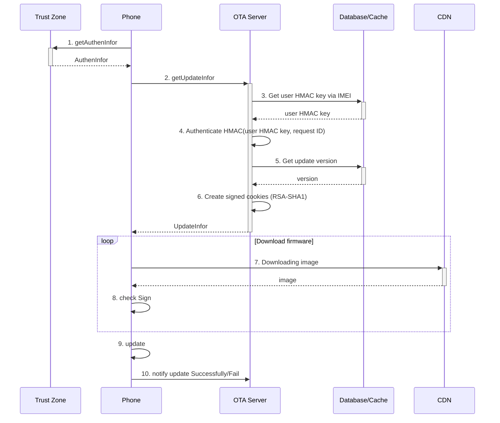
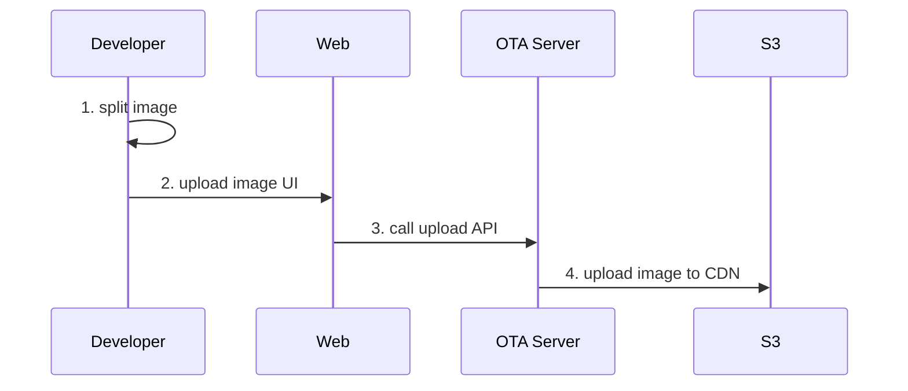
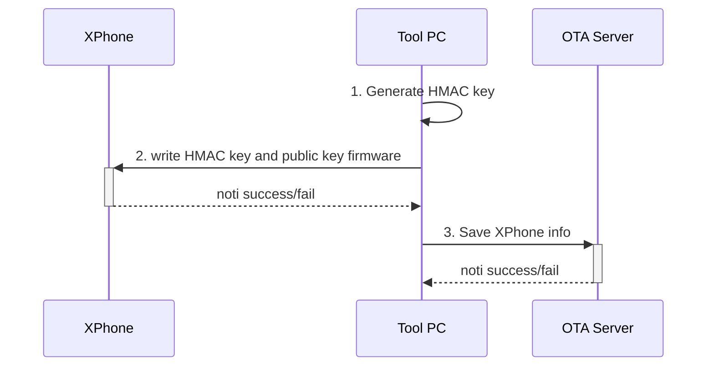

# Thiết kế hệ thống cập nhật firmware OTA cho XPhone

## XPhone lấy thông tin về bản cập nhật

XPhone sẽ chủ động request lên server để hỏi về việc có bản cập nhật hay không

- Auto update: 1 ngày kiểm tra thông tin update 1 lần. Có thể tắt tính năng tự động này
- Manual update: Người dùng tự vào phần update để kiểm tra có bản update hay không

Quy trình kiểm tra bản cập nhật mới và cập nhật nếu có:



### 1. getAuthenInfor

Điện thoại sẽ lấy các thông tin xác thực từ flash. THông tin xác thực này bao gồm:

1. IMEI của điện thoại
2. Password để xác thực với server

### 2. getUpdateInfor

Điện thoại thực hiện gửi request đến OTA server với các thông tin:

1. IMEI
2. request ID (16 byte random)
3. signKey = HMAC_SHA256(key=Password, data=(IMEI + request ID))
4. Phiên bản hiện tại của điện thoại

Thông tin nhận vè từ OTA server sẽ là:

1. Có bản update mới hay không
2. Nếu có bản update mới thì sẽ có thêm thông tin:
   1. Tên bản firmware mới
   2. Cookies để sử dụng
   3. Danh sách các url các file để download
   4. Sign của các file

```
URL: /device/1.0/update/info?IMEI=<IMEI>&requestID=<requestID>&signKey=<signKey>&OSVersion=<OSVersion>&SBLVersion=<SBLVersion>&STMVersion=<STMVersion>&DataVersion=<DataVersion>&TextVersion=<TextVersion>&HWversion=<HWversion>
Method: GET
Respone body: (có bản update)
    UPDATE:update=yes;cookies=263512635175
    OS:num_file=2
    STM:num_file=1
    OS1:url=https://d19sohnjnsw0y4.cloudfront.net/OS/OS1;block=6;lenght=3932160;sign=123123
    OS2:url=https://d19sohnjnsw0y4.cloudfront.net/OS/OS2;block=36;lenght=3932160;sign=123123
    STM1:url=https://d19sohnjnsw0y4.cloudfront.net/STM/STM1;block=6;lenght=3932160;sign=123123

Respone body: (không có bản update)
    UPDATE:update=no

Respone code:
  200: OK
  403: Authentication is failed
```

### 3. Get user HMAC key via IMEI

OTA Server sẽ sử dụng thông tin về IMEI nhận được từ client để xác nhận client để lấy được user HMAC key của client từ database.

### 4. Authenticate HMAC

OTA server tiến hành tính toán HMAC của request ID với key chính là user HMAC key vừa lấy từ database.

`hmac = HMAC_SHA256(key=user HMAC key, data=(IMEI + request ID))`

Sau đó server sẽ so sánh với mã signKey từ client gửi lên để xác nhận request đó được gửi từ XPhone.
Nếu mã HMAC không trùng nhau, server sẽ gửi lại thông báo lỗi và kết thúc phiên.

### 5. Get update version

Sau khi đã xác nhận request được gửi từ XPhone, server sẽ dựa vào tên phiên bản firmware hiện tại để xác định xem có cần update hay không.

Nếu không cần update, OTA server sẽ trả vè thông báo không có version mới và kết thúc phiên. Nếu có bản update mới no sẽ thực hiện tiếp [bước 6](#6-create-signed-cookies)

### 6. Create signed cookies

OTA server sẽ sử dụng thuật toán RSA-SHA1 để tạo ra cookies cho client sử dụng download firmware sau này.

### 7. Downloading image

Sử dụng thông tin về cookies và danh sách url vừa nhận được từ OTA server, XPhone sẽ download các file firmware về máy.

### 8. check Sign

Xphone sẽ lấy thông tin public key từ bộ nhớ và tính RSA Sign của các file vừa tải về. Nếu RSA Sign bị sai so với thông tin nhận được ban đầu, XPhone sẽ tiến hành download lại file đó. Nếu đúng nó sẽ tiến hành ghi vào flash.

### 9. update

Sau khi download xong toàn bộ các file firmware, Xphone sẽ tiến hành khỏi động lại và load vào firmware mới.

### 10. notify update Successfully/Fail

Sau khi load vào firmware mới lần đầu, XPhone sẽ gửi thông tin về việc update lỗi hay thành công cho OTA server.

```
URL: /device/1.0/update/noti?IMEI=<IMEI>&requestID=<requestID>&signKey=<signKey>&OSVersion=<OSVersion>&SBLVersion=<SBLVersion>&STMVersion=<STMVersion>&DataVersion=<DataVersion>&TextVersion=<TextVersion>&HWversion=<HWversion>
Method: POST

Respone code:
  200: OK
  403: Authentication is failed
  500: Fail
```

## Nhà sản xuất thêm firware mới



### 1. split image

Khi release bản firmware mới, nhân viên sẽ chạy phần mềm để chia file firmware thành các file nhỏ hơn.

Tên file sau khi chia cần có format như sau:
`<version>_<type>_<number>_<block>_length>`

Ví dụ: `1.0.0_OS_00_6_21321`

### 2. upload image UI

Khi release bản firmware mới, nhân viên sẽ đăng nhập vào trang web để tải firmware mới lên

### 3. call upload API

Web client sẽ gọi vào API của OTA server để upload firmware lên.

```
URL: /dev/1.0/upload?user=<user>&requestID=<requestID>&signKey=<signKey>&production=<production>
Method: POST
Content Type: “form-data”
Body:
  file: file content
```

### 4. upload image to CDN

Sau khi nhận được file từ web client, server sẽ kiểm tra tính hợp lệ và upload lên S3. Đường dẫn của 1 file sẽ có cấu trúc:

`<Tên dòng máy>/<Tên firmware>/<Tên version>/<Tên firmware><Số thứ tự>_<block>_<length>_<sign>`

Trong đó giá trị `sign` được tính theo công thức:

```
sign = RSA_SHA256(key = firmware key, data = CRC32(firmware))
```

Các firmware sẽ được lưu trong các thưa mục tương tự như sau:

```
.
└── XPhone_v1
    ├── SBL
    │   └── cn_1.0.0
    │       ├── SBL01_6_1234_12312312312312
    │       └── SBL02_36_1234_12312312312312
    ├── DATA
    │   ├── cn_1.0.0
    │   │   └── DATA01_4_657_12312312312312
    │   └── vn_1.0.0
    │       └── DATA01_4_123_12312312312312
    ├── OS
    │   ├── cn_1.0.0
    │   |   ├── OS01_6_1234_12312312312312
    │   |   ├── OS03_36_1234_12312312312312
    │   |   ├── OS04_96_1234_12312312312312
    │   |   └── OS05_126_1234_12312312312312
    │   └── vn_1.0.0
    │       ├── OS01_6_1234_12312312312312
    │       ├── OS03_36_1234_12312312312312
    │       ├── OS04_96_1234_12312312312312
    │       └── OS05_126_1234_12312312312312
    ├── STM
    │   ├── cn_1.0.0
    │   │   └── STM01_6_12_12312312312312
    │   └── vn_1.0.0
    │       └── STM01_6_23_12312312312312
    └── TEXT
        ├── cn_1.0.0
        │   └── TEXT01_6_34_12312312312312
        └── vn_1.0.0
            └── TEXT01_6_56_12312312312312
```

## Thay đổi thi nạp firmware khi sản xuất



### 1. Generate HMAC key

Tool PC thực hiện tạo HMAC key ngẫu nhiên cho từng điện thoại

### 2. write HMAC key and password

Tool PC ghi HMAC key và public key của firmware xuống XPhone
Nếu thành công, Xphone trả lại IMEI cho tool PC

### 3. Save XPhone info

Sau khi ghi thành công HMAC key và public key của firmware xuống XPhone, tool PC thực hiện gửi thông tin đó lên OTA server để lưu trữ trong database

```
URL: /dev/1.0/device?user=<user>&requestID=<requestID>&signKey=<signKey>&IMEI=<IMEI>&production=<production>&OSVersion=<OSVersion>&SBLVersion=<SBLVersion>&STMVersion=<STMVersion>&DataVersion=<DataVersion>&TextVersion=<TextVersion>&HWversion=<HWversion>&key=<key>&production=<production>
Method: POST

Respone code:
  200: OK
  403: Authentication is failed
  500: Fail
```
